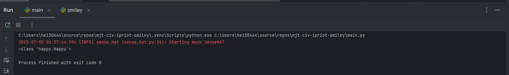
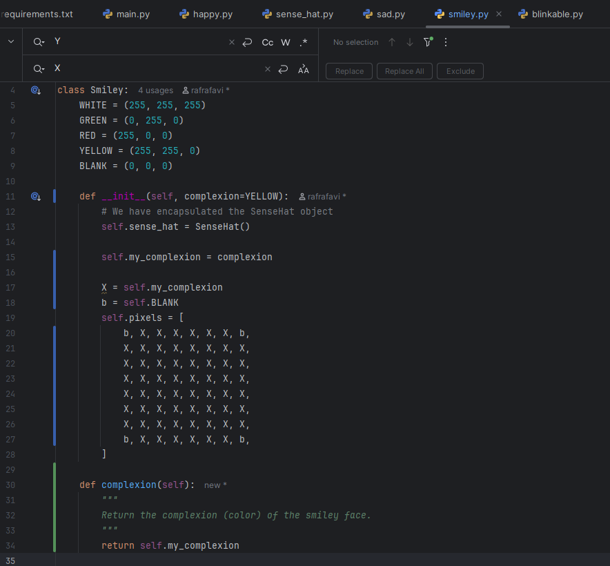

# Evidence and Knowledge

This document includes instructions and knowledge questions that must be completed to receive a *Competent* grade on this portfolio task.

## 1. Required evidence

### 1.1. Answer all questions in this document

- Each answer should be complete, well-articulated, and within the specified word count limits (if added) for each question.
- Please make sure **all** external sources are properly cited.
- You must **use your own words**. Please include your full chat transcripts if you use generative AI in any way.
- Generative AI hallucinates, is not an authoritative source

### 1.2. Make all the required modifications to the code

- Please follow the instructions in this document to make the changes needed to the code.

- When requested to upload evidence, upload all screenshots to `screenshots/` and embed them in this document. For example:

```markdown

```


> Note the `!`, and the use of a relative path.

- You must upload the code into your GitHub repository.
- While you can use a branch, your code should be in main when you submit.
- Upload a zip of this repository to Blackboard when you are ready to submit.
- You will be notified of your result via Blackboard
- However, if using GitHub classrooms, you may also receive additional feedback on GitHub directly

### 1.3. Optional: Use of Raspberry Pi and SenseHat

Raspberry Pi or SenseHat is **optional** for this activity. You can use the included `sense_hat.py` file to simulate the SenseHat on your computer.

If you use a Pi, please **delete** the `sense_hat.py` file.

### 1.4. Accessible version of the code

This project relies on visual patterns that appear on an LED matrix. If you have any accessibility requirements, you can use the `udl/accessible` branch to complete the project. This branch provides an accessible code version that uses text-based patterns instead of visual ones.

Please discuss this with your lecturer before using that branch.

## 2. Specific Tasks & Questions

Address the following tasks and questions based on the code provided in this repository.

### 2.1. Set up the project locally

1. Fork this repository (if not using GitHub Classrooms)
2. Clone your repository locally
3. Run the project locally by executing the `main.py` file
4. Evidence this by providing screenshots of the project directory structure and the output of the `main.py` file


If you are running on a Raspberry Pi, you can use the following command to run the project and then screenshot the result:

```bash
ls
python3 main.py
```

### 2.2. Fundamental code comprehension

 Answer each of the following questions **as they relate to that code** supplied by in this repository (ignore `sense_hat.py`):

1. Examine the code for the `smiley.py` file and provide  an example of a variable of each of the following types and their corresponding values (`_` should be replaced with the appropriate values):

   | Type                    | name            | value           |
   |-------------------------|-----------------|-----------------|
   | built-in primitive type | tuple           | 255             |
   | built-in composite type | list of tuple   | (255, 255, 255) |
   | user-defined type       | self.sense_hat  | SenseHat()      |

> GeeksforGeeks. (2024, August). Primitive Data Types vs Non Primitive Data Types in Python. GeeksforGeeks; GeeksforGeeks. https://www.geeksforgeeks.org/primitive-data-types-vs-non-primitive-data-types-in-python/

> Composite Method - Python Design Patterns. (2020, February 9). GeeksforGeeks. https://www.geeksforgeeks.org/composite-method-python-design-patterns/

> Composite Method - Python Design Patterns. (2020, February 9). GeeksforGeeks. https://www.geeksforgeeks.org/composite-method-python-design-patterns/

 Fill in (`_`) the following table based on the code in `smiley.py`:

   | Object        | Type        |
   |---------------|-------------|
   | pixels        | list        |
   | my_complexion | tuple       |
   | WHITE         | tuple       |
   | Self          | happy.Happy |
 
> "self is calling class happy.Happy"
> 
> 

3. Examine the code for `smiley.py`, `sad.py`, and `happy.py`. Give an example of each of the following control structures using an example from **each** of these files. Include the first line and the line range:

   | Control Flow | File   | First line              | Line range |
   |--------------|--------|-------------------------|------------|
   | sequence     | Smiley | WHITE = (255, 255, 255) | 5 to 26    |
   | selection    | Sad    | if wide_open:           | 28 to 31   |
   | iteration    | happy  | for pixel in mouth:     | 20 to 22   |

> Mitropoulos, F. J. (2018, August 31). Sequence, Selection, and Iteration - The Building Blocks of Programming Languages • The Learn Programming Academy. The Learn Programming Academy. https://learnprogramming.academy/programming/sequence-selection-and-iteration-the-building-blocks-of-programming-languages/

4. Though everything in Python is an object, it is sometimes said to have four "primitive" types. Examining the three files `smiley.py`, `sad.py`, and `happy.py`, identify which of the following types are used in any of these files, and give an example of each (use an example from the code, if applicable, otherwise provide an example of your own):

   | Type        | Used? | Example                          |
   |-------------|-------|----------------------------------|
   | int         | happy | mouth = [41, 46, 50, 51, 52, 53] |
   | float       | happy | delay=0.25                       |
   | str         | _     | y = "Yellow"                     |
   | bool        | happy | wide_open=True                   |

5. Examining `smiley.py`, provide an example of a class variable and an instance variable (attribute). Explain **why** one is defined as a class variable and the other as an instance variable.

> "YELLOW = (255, 255, 0)" is a class variable and "Y = self. YELLOW". The instance variable allow the user to use a different class variable in a deferment situation
>

6. Examine `happy.py`, and identify the constructor (initializer) for the `Happy` class:
   1. What is the purpose of a constructor (in general) and this one (in particular)?

   > The constructors are to initialise the object in the class. in this particular constractor is setting the pixels matrix
   >

   2. What statement(s) does it execute (consider the `super` call), and what is the result?

   > First it will initialise the parents which are smily and blinkable by using super call. This would create the smily pixels
   > Then it will run the draw_mouth which set the blank pixels for month 
   > Then will run draw_eyes which set the eyes pixels

### 2.3. Code style

1. What code style is used in the code? Is it likely to be the same as the code style used in the SenseHat? Give to reasons as to why/why not:

> The code style used in the code is PEP 8. Yes, PEP 8 is universal code righting standard for python. 
>

2. List three aspects of this convention you see applied in the code.

> Use of 4 spaces, 
> use of 2 blank line separating functions
> using _ in variables naming as an example in SenseHat snake case were used as an example "run_hat_gui" 
> """ """ where used for comment
>

3. Give two examples of organizational documentation in the code.

> Using comments # and docstring """ """
>

### 2.4. Identifying and understanding classes

> Note: Ignore the `sense_hat.py` file when answering the questions below

1. List all the classes you identified in the project. Indicate which classes are base classes and which are subclasses. For subclasses, identify all direct base classes.
  
  Use the following table for your answers:

| Class Name | Super or Sub? | Direct parent(s)  |
|------------|---------------|-------------------|
| Smiley     | Super         | N/A               |
| Happy      | Sub           | Smiley, Blinkable |
| Sad        | Sub           | Smiley            |
| Blinkable  | Super         | N/A               |
|            |               |                   |


2. Explain the concept of abstraction, giving an example from the project (note "implementing an ABC" is **not** in itself an example of abstraction). (Max 150 words)

>  Abstraction is for hiding complex coding details and showing only what is needed and without need of knowing the underlying mechanic.

> Team, G. L. (2021b, May 13). Abstraction in Python. Great Learning Blog: Free Resources What Matters to Shape Your Career! https://www.mygreatlearning.com/blog/abstraction-in-python/


3. What is the name of the process of deriving from base classes? What is its purpose in this project? (Max 150 words)

> Inheritance, the purpose is to inherit the main common pixels and change what needed to reduce duplication such as draw_mouth and draw_eyes


### 2.5. Compare and contrast classes

Compare and contrast the classes Happy and Sad.

1. What is the key difference between the two classes?
   > Happy inherent from Blinkable vs sad did not import Blinkable 
   >
2. What are the key similarities?
   > tey both have mouth and eyes functionality
   >
3. What difference stands out the most to you and why?
   > Happy has blink function and sad dose not
   >
4. How does this difference affect the functionality of these classes
   > The difference made the Happy class to blink vs sad does not have this function
   >

### 2.6. Where is the Sense(Hat) in the code?

1. Which class(es) utilize the functionality of the SenseHat?
   > Smiley, Happy and Sad
   >
2. Which of these classes directly interact with the SenseHat functionalities?
   > Smiley
   >
3. Discuss the hiding of the SenseHAT in terms of encapsulation (100-200 Words)
   > Encapsulation means hiding the parts of the program we don’t need to see and only showing what is needed. In this project, the SenseHat is created inside the Smiley class using self.sense_hat.
   > This means other classes like Happy and Sad don’t talk to SenseHat directly. They just use the methods from Smiley, and Smiley handles sending the data to the SenseHat display.
   > This is good because if one day we change the display from a SenseHat to something else, we only need to update the code in Smiley, and the other classes will still work fine. It keeps the program simple, tidy, and easier to manage.

### 2.7. Sad Smileys Can’t Blink (Or Can They?)

Unlike the `Happy` smiley, the current implementation of the `Sad` smiley does not possess the ability to blink. Let's first explore how blinking has been implemented in the Happy Smiley by examining the blink() method, which takes one argument that determines the duration of the blink.

**Understanding Blink Mechanism:**

1. Does the code's author believe that every `Smiley` should be able to blink? Explain.

> I think the author,s idea was that not every Smiley needs to blink. This is because the Smiley class does not have a blink() method. Only sassess like Happy inherit from both Smily and Blinable which means only some smileys can blink.
> The author ised an abstract class called Blinkable so that only the smilys that need to blink will have the blink() method. This is called abstraction, because it shows what needs to be done but not how it works. the smileys that can blink will write their own blink() method.
> If every smiley had to blink the blink() method would be inside the Smily class but it is not. That is why I think the author did not expect smily to blink.

2. For those smileys that blink, does the author expect them to blink in the same way? Explain.

> No, the blink function could be set by programmer. as an example can set sad to blink 3 tome with longer time between each blink.
>

3. Referring to the implementation of blink in the Happy and Sad Smiley classes, give a brief explanation of what polymorphism is.

> Polymorphism means different classes can have the same method name, but each one does something different when that method is called. 
> In this project, both Happy and (if added) Sad can have a method called blink(), but the way each one works can be different. 
> When the main program calls smiley.blink(), it doesn’t care if it’s a Happy or Sad smiley — it just runs whatever blink() belongs to that smiley. 
> This makes the code flexible because we can add new smileys with their own blink style without changing the main program.
> 
> Polymorphism in Python(with Examples). (n.d.). Www.programiz.com. https://www.programiz.com/python-programming/polymorphism
>

4. How is inheritance used in the blink method, and why is it important for polymorphism?

> in blink inherit the full face from smily which is the parent class and change the eye pixel only to open and close.
> it will allow deferment clasess to work differently. as an example smily will bling hoever the sad do not

1. **Implement Blink in Sad Class:**

   - Create a new method called `blink` within the Sad class. Ensure you use the same method signature as in the Happy class:

   ```python
   def blink(self, delay=0.25):
        """
        Blinks the smiley's eyes once

        :param delay: Delay between blinks (in seconds)
        """
        self.draw_eyes(wide_open=False)
        self.show()
        time.sleep(delay)
        self.draw_eyes(wide_open=True)
        self.show()
   ```

2. **Code Implementation:** Implement the code that allows the Sad smiley to blink. Use the implementation from the Happy Smiley as a reference. Ensure your new method functions similarly by controlling the blink duration through the `delay` argument.

3. **Testing the Implementation:**

- Test the new blink functionality on your Raspberry Pi or within the Python classes provided. You might need to adjust the `main.py` script to incorporate Sad Smiley's new blinking capability.

Include a screenshot of the sad smiley or the modified `main.py`:


- Observe and document the Sad smiley as it blinks its eyes. Describe any adjustments or issues encountered during implementation.

  > I have imported sad and changed pass Sad to smily

  ### 2.8. If It Walks Like a Duck…

  Previously, you implemented the blink functionality for the Sad smiley without utilizing the class `Blinkable`. Assuming you did not use `Blinkable` (even if you actually did), consider how the Sad smiley could blink similarly to the Happy smiley without this specific class.

  1. **Class Type Analysis:** What kind of class is `Blinkable`? Inspect its superclass for clues about its classification.

  > Abstract Base Classes

> abc — Abstract Base Classes. (2025). Python Documentation. https://docs.python.org/3.12/library/abc.html#abc.abstractmethod

> Abstract Classes in Python. (2019, January 10). GeeksforGeeks. https://www.geeksforgeeks.org/abstract-classes-in-python/

  2. **Class Implementation:** `Blinkable` is a class intended to be implemented by other classes. What generic term describes this kind of class, which is designed for implementation by others? **Clue**: Notice the lack of any concrete implementation and the naming convention.

  > yes, interface

  3. **OO Principle Identification:** Regarding your answer to question (2), which Object-Oriented (OO) principle does this represent? Choose from the following and justify your answer in 1-2 sentences: Abstraction, Polymorphism, Inheritance, Encapsulation.

  > Abstraction, the interface shows what it needs to be done and how the class should perform without performing them.

  > k0nze. (2024, February 22). Python Interfaces and Abstract Base Class (ABC): A Must-Know for Advanced Programmers. YouTube. https://www.youtube.com/watch?v=kaZceE16m5A

  4. **Implementation Flexibility:** Explain why you could grant the Sad Smiley a blinking feature similar to the Happy Smiley's implementation, even without directly using `Blinkable`.

  > Blinkable is not require to inherit fron it. As the blink is method it can be used in any class.

  5. **Concept and Language Specificity:** In relation to your response to question (4), what is this capability known as, and why is it feasible in Python and many other dynamically typed languages but not in most statically typed programming languages like C#? **Clue** This concept is hinted at in the title of this section.

  > It describes as duck typing. it makes it feasible to pass a behavior just by implementing a method.
  > In python the interpreter loads all the code but does not check them, and it only checks them if the code is executing vs c# check the tips all the time. 
  
> k0nze. (2024, February 22). Python Interfaces and Abstract Base Class (ABC): A Must-Know for Advanced Programmers. YouTube. https://www.youtube.com/watch?v=kaZceE16m5A

  ***

  ## 3. Refactoring

  ### 3.1. Does a Smiley Have to Be Yellow?

  While our current implementation predominantly features yellow smileys, emotional expressions like sickness or anger typically utilize colors like green, red, or orange. We'll explore the feasibility of integrating these colors into our smileys.

  1. **Defined Colors and Their Location:**

     1. Which colors are defined and in which class(s)?
        > the colors are: WHITE, GREEN, RED, YELLOW and Black (BLANK). and they are in Smiley
     2. What type of variables hold these colors? Are the values expected to change during the program's execution? Explain your answer.
        > the variable is list of Tuples and the values are not ment to be changed.
     3. Add the color blue to the appropriate class using the appropriate format and values.

  2. **Usage of Color Variables:**

     1. In which classes are the color variables used?
        > Smily

  3. **Simple Method to Change Colors:**
  4. What is the easiest way you can think to change the smileys to green? Easiest, not necessarily the best!
     > Changing the dolor described pixel (Y and O) to background and face and pass the coolers to background and face

  Here's a revised version of the "Flexible Colors – Step 1" section for the smiley project, incorporating your specifications for formatting and content updates:

  ### 3.2. Flexible Colors – Step 1

  Changing the color of the smileys once is straightforward, but it isn't very flexible. To facilitate various colors for smileys, it is advisable not to hardcode values in any class. This approach was identified earlier as a necessary change. Let's start by removing the built-in assumptions about color in our classes.

  1. **Add a method called `complexion` to the `Smiley` class:** Implement this instance method to return `self.YELLOW`. Using the term "complexion" instead of "color" provides a more abstract terminology that focuses on the meaning rather than implementation.

  2. **Refactor subclasses to use the `complexion` method:** Modify any subclass that directly accesses the color variable to instead utilize the new `complexion` method. This ensures that color handling is centralized and can be easily modified in the future.

  3. **Determine the applicable Object-Oriented principle:** Consider whether Abstraction, Polymorphism, Inheritance, or Encapsulation best applies to the modifications made in this step.

  4. **Verify the implementation:** Ensure that the modifications function as expected. The smileys should still display in yellow, confirming that the new method correctly replaces the direct color references.

  This step is crucial for setting up a more flexible system for color management in the smiley display logic, allowing for easy adjustments and extensions in the future.


  ### 3.3. Flexible Colors – Step 2

  Having removed the hardcoded color values, we now enhance the base class to support dynamic color assignments more effectively.

  1. **Modify the `__init__()` method in the `Smiley` class:** Introduce a default argument named `complexion` and assign `YELLOW` as its default value. This allows the instantiation of smileys with customizable colors.

  2. **Introduce a new instance variable:** Create a variable called `my_complexion` and assign the `complexion` parameter to it. This step ensures that each smiley instance can maintain its own color state.

  3. **Rationale for `my_complexion`:** Using a distinct instance variable like `my_complexion` avoids potential conflicts with the method parameter names and clarifies that it is an attribute specific to the object.

  4. **Bulk rename:** We want to update our grid to use the value of complexion, but we have so many `Y`'s in the grid. Use your IDE's refactoring tool to rename all instances of the **symbol** `Y` to `X`. Where `X` is the value of the `complexion` variable. Include a screenshot evidencing you have found the correct refactor tool and the changes made.

  

  5. **Update the `complexion` method:** Adjust this method to return `self.my_complexion`, ensuring that whatever color is assigned during instantiation is what the smiley displays.

  6. **Verification:** Run the updated code to confirm that Smileys still defaults to yellow unless specified otherwise.

  ### 3.4. Flexible Colors – Step 3

  With the foundational changes in place, it's now possible to implement varied smiley colors for different emotional expressions.

  1. **Adjust the `Sad` class initialization:** In the `Sad` class's initializer method, change the superclass call to include the `complexion` argument with the value `self.BLUE`, as shown:

     ```python
     super().__init__(complexion=self.BLUE)
     ```

  2. **Test color functionality for the Sad smiley:** Execute the program to verify that the Sad smiley now appears blue.

  3. **Ensure the Happy smiley remains yellow:** Confirm that changes to the Sad smiley do not affect the default color of the Happy smiley, which should still display in yellow.

  4. **Design and Implement An Angry Smiley:** Create an Angry smiley class that inherits from the `Smiley` class. Set the color of the Angry smiley to red by passing `self.RED` as the `complexion` argument in the superclass call.

  ***
